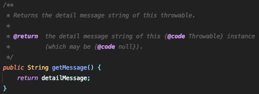
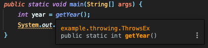

# exception throwing, re-throwing, chaining

## 예외 던지기(exception throwing)

프로그램이 실행되다 발생하는 예외 외에도, 우리가 **직접 예외를 발생**시키는 것도 가능합니다.

우리가 한달동안 많이 사용했던 콘솔로 입력받아 정수에 저장하는 경우로 예를 들어볼게요.

```java
public class ThrowEx {

    public static void main(String[] args) {
        Scanner sc = new Scanner(System.in);
        int year = Integer.parseInt(sc.nextLine());
        System.out.println(year);
    }
}
```

이런 경우에, 프로그램이 실행되다가 정수로 변환될 수 없는 문자열이 입력된다면 `NumberFormatException`이 발생하면서 프로그램은 종료되게 됩니다.

```java
public class ThrowEx {

    public static void main(String[] args) {
        Scanner sc = new Scanner(System.in);
        try {
            int year = Integer.parseInt(sc.nextLine());
            System.out.println(year);
        } catch (NumberFormatException e) {
            System.out.println("NumberFormatException!");
        }
    }
}
```

그러나 이런 경우 외에도 *year가 0000-9999의 범위를 벗어나는 경우*에도 예외를 발생시키고 싶다면?

이럴 때 **`throw` 키워드를 사용**해서 우리가 직접 고의로 예외를 발생시킬 수 있습니다.

```java
public class ThrowEx {

    public static void main(String[] args) {
        Scanner sc = new Scanner(System.in);
        try {
            int year = Integer.parseInt(sc.nextLine());
            if (!(0 <= year && year <= 9999)) {
                throw new InputMismatchException("범위(0~9999)가 유효하지 않습니다.");
            }
            System.out.println(year);
        } catch (NumberFormatException e) {
            System.out.println("NumberFormatException!");
        } catch (InputMismatchException e) {
            System.out.println(e.getMessage());
        }
    }
}
```

방법은 `new`를 이용해서 발생시키려는 예외 클래스의 객체를 만들어, `throw` 키워드를 이용하여 예외를 던지면 됩니다.

- 이 때 예외 클래스 생성자에 `String`을 넣어주면 예외 인스턴스에 `String` 값이 메시지로 저장됩니다.  
  
- 그리고 이 메시지는 `getMessage()`를 이용해서 얻어올 수 있습니다.  
  

이 외에도 **예외를 메서드에 선언**하는 방법이 있습니다.

이는 이 메서드를 호출했을 때 발생 가능한 예외를 선언부에 명시하여 호출하는 쪽에 알리고, **호출하는 쪽에서 처리를 하도록 떠넘기는 방법**입니다.

예시를 위해 위 예제의 메소드를 분리해보겠습니다.

```java
public class ThrowsEx {

    public static int getYear() {
        Scanner sc = new Scanner(System.in);
        int year = Integer.parseInt(sc.nextLine());
        if (!(0 <= year && year <= 9999)) {
            throw new InputMismatchException("범위(0~9999)가 유효하지 않습니다.");
        }
        return year;
    }

    public static void main(String[] args) {
        int year = getYear();
        System.out.println(year);
    }
}
```

방법은 메서드의 선언부에 `throws` 키워드를 사용해서 메서드 내에서 발생할 수 있는 예외를 쉼표(`,`)로 구분하여 적어주면 됩니다.

```java
public class ThrowsEx {

    public static int getYear() throws NumberFormatException, InputMismatchException {
        Scanner sc = new Scanner(System.in);
        int year = Integer.parseInt(sc.nextLine());
        if (!(0 <= year && year <= 9999)) {
            throw new InputMismatchException("범위(0~9999)가 유효하지 않습니다.");
        }
        return year;
    }

    public static void main(String[] args) {
        int year = getYear();
        System.out.println(year);
    }
}
```

전에는 메서드를 사용하는 쪽에서 이 메서드를 사용하기 위해서 어떤 예외들이 처리되어야 하는지 알 수 없었는데,  


메서드의 선언부에 예외를 선언함으로써 메서드를 사용하는 쪽에서 어떤 예외들이 처리되어야 하는지 쉽게 알 수 있게 되고, 또 사용하는 쪽에게 이에 대한 처리를 하도록 강요함으로써 보다 더 견고한 프로그램 코드를 작성할 수 있게 되었습니다.  
  
예외를 전달받은 메서드가 전달받은 예외를 다시 떠넘길 수도 있으며, 이는 계속 호출스택에 있는 메서드들을 따라 전달되다가 `main` 메서드에서도 예외가 처리되지 않으면, 메인 메서드도 종료되어 프로그램이 종료됩니다.

```java
public class ThrowsEx {

    public static int getYear() throws NumberFormatException, InputMismatchException {
        Scanner sc = new Scanner(System.in);
        int year = Integer.parseInt(sc.nextLine());
        if (!(0 <= year && year <= 9999)) {
            throw new InputMismatchException("범위(0~9999)가 유효하지 않습니다.");
        }
        return year;
    }

    public static void printYear() throws NumberFormatException, InputMismatchException {
        int year = getYear();
        System.out.println(year);
    }

    public static void main(String[] args) {
        printYear();
    }
}
```


- 이 때는 JVM의 기본 예외 처리기가 stack을 출력합니다.

따라서 `throws`를 이용한 예외 떠넘기기는 예외가 처리된 것이 아니라 전달(떠넘김)만 한 것이기 때문에 **반드시 어디선가 `try-catch`로 예외 처리**를 해주어야 합니다.

```java
public class ThrowsEx {

    public static int getYear() throws NumberFormatException, InputMismatchException {
        Scanner sc = new Scanner(System.in);
        int year = Integer.parseInt(sc.nextLine());
        if (!(0 <= year && year <= 9999)) {
            throw new InputMismatchException("범위(0~9999)가 유효하지 않습니다.");
        }
        return year;
    }

    public static void printYear() throws NumberFormatException, InputMismatchException {
        try {
            int year = getYear();
            System.out.println(year);
        } catch (NumberFormatException e) {
            System.out.println("숫자만 입력");
        } catch (InputMismatchException e) {
            System.out.println(e.getMessage());
        }
    }

    public static void main(String[] args) {
        printYear();
    }
}
```

처리의 분담도 가능한데, 예외가 발생한 메서드 내에서 자체적으로 처리해도 되는 것은 메서드 내에서 처리하고, 메서드 내에서 자체적으로 해결이 안 되는 경우에 예외를 메서드에 선언하여 호출한 메서드를 처리하도록 하는 방법입니다. 이를 구현하기 위해 예외 되던지기를 사용합니다.

## 예외 되던지기(exception re-throwing)

예외 되던지기란 **예외를 처리한 후에 인위적으로 다시 예외를 발생**시키는 것입니다.

호출한 메서드와 호출된 메서드 양 쪽 모두에서 예외를 처리하도록 처리를 분담할 때 사용합니다.

```java
public class ReThrowing {
    private static int year;

    public static int getYear() throws NumberFormatException, InputMismatchException {
        Scanner sc = new Scanner(System.in);
        try {
            int inputYear = Integer.parseInt(sc.nextLine());
            if (!(0 <= inputYear && inputYear <= 9999)) {
                throw new InputMismatchException("범위(0~9999)가 유효하지 않습니다.");
            }
            return inputYear;
        } catch (NumberFormatException e) {
            year = 2021;
            throw new NumberFormatException("NumberFormatException! 현재 년도로 초기화합니다.");
        } catch (InputMismatchException e) {
            year = 2021;
            throw new InputMismatchException("범위(0~9999)가 유효하지 않습니다. 현재 년도로 초기화합니다.");
        }
    }

    public static void printYear() {
        try {
            year = getYear();
            System.out.println(year);
        } catch (NumberFormatException e) {
            System.out.println(e.getMessage());
            System.out.println(year);
        } catch (InputMismatchException e) {
            System.out.println(e.getMessage());
            System.out.println(year);
        }
    }

    public static void main(String[] args) {
        printYear();
    }
}
```

예외가 발생할 메서드(`getYear`)에서는 `try-catch`문을 사용해서 예외처리(`year`에 `2021`할당)를 해주고 `throw`문을 사용하여 예외를 다시 발생시킵니다. 동시에 메서드의 선언부에 발생할 예외를 `throws`를 이용하여 명시해 줍니다.  
  
`getYear`, `printYear` 양쪽의 `catch`블럭이 모두 수행된 결과를 확인할 수 있습니다.

## 연결된 예외(chained exception)

한 예외가 다른 예외를 발생시킬 수도 있습니다. 예외 A가 예외 B를 발생시켰다면, A를 B의 `원인 예외(cause exception)`이라고 합니다.

`원인 예외를 포함할 예외클래스.initCause(원인 예외 클래스)`를 사용하여 지정한 예외를 원인 예외로 등록합니다.  
  
`getCause()`를 사용하여 원인 예외를 반환합니다.  


발생한 예외를 그냥 처리하면 되는데 이렇게 번거롭게 원인 예외를 등록하여 다시 예외를 발생시키는 이유는 다음과 같습니다.

- 상속관계에 상관없이 예외가 원인 예외를 포함할 수 있도록 하여 여러가지 예외를 하나의 큰 분류의 예외로 묶어서 다루기 위해서

  ```java
  try {
    install();
  } catch(Exception1 e) {
    e.printStackTrace();
  } catch(Exception2 e) {
    e.printStackTrace();
  } catch(Exception3 e) {
    e.printStackTrace();
  } catch(Exception4 e) {
    e.printStackTrace();
  } catch(Exception5 e) {
    e.printStackTrace();
  }
  ```

  이렇게 너무 많은 `catch` 블럭을 쓰는게 부담스러울 때, `install()`이 발생시킬 수 있는 예외들을 하나의 예외(`InstallException`)의 원인 예외로 등록하여 메서드에 선언하면

  ```java
  void install() throws InstallException {
    try {
      startInstall();
      copyFiles();
    } catch (Exception1 e) {
      InstallException ie = new InstallException("설치중 예외발생");
      ie.initCause(e);
      throw ie;
    } catch (Exception2 e) {
      InstallException ie = new InstallException("설치중 예외발생");
      ie.initCause(e);
      throw ie;
    } catch (Exception3 e) {
      InstallException ie = new InstallException("설치중 예외발생");
      ie.initCause(e);
      throw ie;
    } catch (Exception4 e) {
      InstallException ie = new InstallException("설치중 예외발생");
      ie.initCause(e);
      throw ie;
    } catch (Exception5 e) {
      InstallException ie = new InstallException("설치중 예외발생");
      ie.initCause(e);
      throw ie;
    }
  }
  ```

  사용하는 쪽에서는 하나의 상속관계가 아닌 예외라도 하나의 `catch`블럭으로 처리가 가능해 지고, 실제로 발생한 예외가 어떤 것인지도 알 수 있게 됩니다.

  ```java
  try {
    install();
  } catch(InstallException e) {
    e.printStackTrace();
  }
  ```

- `checked` 예외를 `unchecked` 예외로 변경하기 위해서  
  자바가 처음 개발되던 때와 환경이 많이 바뀌면서, 필수로 예외를 처리해야하는 `checked` 예외가 의미 없어지는 상황이 생기기 시작하였습니다.

  이런 경우에 의미없는 `try-catch`문을 추가하는 대신에 `unchecked` 예외인 `RuntimeException`의 원인 예외로 등록하여 감싸는 방법으로 `unchecked` 예외로 변경하여 억지로 예외처리를 하지 않을 수 있습니다.

  ```java
  void install() throws InstallException {
    try {
      startInstall();
      copyFiles();
    } catch (Exception1 e) {
      throw new RuntimeException(new Exception1)
    } catch (Exception2 e) {
      throw new RuntimeException(new Exception2)
    } catch (Exception3 e) {
      throw new RuntimeException(new Exception3)
    } catch (Exception4 e) {
      throw new RuntimeException(new Exception4)
    } catch (Exception5 e) {
      throw new RuntimeException(new Exception5)
    }
  }
  ```
