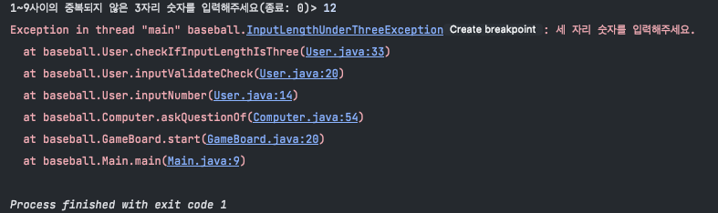

## 예외처리 과정

### 예외 처리 방법

1. 예외 복구

* 예외상황을 파악하고 문제를 해결해서 정상상태로 돌려놓는 방법.
```java
public String askQuestionOf(User user){
  System.out.print("1~9사이의 중복되지 않은 3자리 숫자를 입력해주세요(종료: 0)> ");
  String userInput = "";
  try {
    userInput = user.inputNumber();
  } catch (IllegalArgumentException e) {
    System.out.println(e.getMessage());
    askQuestionOf(user);
  }
  return userInput;
}
```

1~9로 이루어진 중복되지 않은 세 자리의 숫자를 입력받는 예제이다. <br>

만약 원하는 숫자를 입력받지 못한 경우(3자리가 아니거나, 숫자가 중복되었거나, 숫자가 아니거나) IllegalArgumentException예외가 발생하여 catch블럭으로 진입하게 된다.<br>

위 예제는 발생할 예외를 미리 예측하여 원하는 입력결과를 받을 때까지 메서드를 재귀호출하여 예외상황을 해결한다. 

<br><br>

2. 예외처리 회피

* 메서드를 호출한 쪽에 예외를 전달하여 예외처리를 떠맡기는 방법.

```java
public String inputNumber() throws IllegalArgumentException {
    String answer = sc.nextLine();
    inputValidateCheck(answer);
    return answer;
  }

  private void inputValidateCheck(String answer) throws IllegalArgumentException {
    checkIfInputHasNumberOnly(answer);
    checkIfInputLengthIsThree(answer);
    checkIfInputHasDulplicateNumber(answer);
  }

  private void checkIfInputHasDulplicateNumber(String answer) throws DuplicateNumberException {
    Set<String> answerSet = new HashSet<>(List.of(answer.split("")));
    if (answer.length() == 3 && answerSet.size() < 3) {
      throw new DuplicateNumberException("중복되지 않은 숫자를 입력해 주세요.");
    }
  }

  private void checkIfInputLengthIsThree(String answer) throws InputLengthUnderThreeException {
    if (!answer.equals("0") && answer.length() < 3) {
      throw new InputLengthUnderThreeException("세 자리 숫자를 입력해주세요.");
    }
  }

  private void checkIfInputHasNumberOnly(String answer) throws NumberFormatException {
    try {
      Integer.parseInt(answer);
    } catch (NumberFormatException e) {
      throw new NumberFormatException("숫자만 입력해주세요.");
    }
  }
```

위 예제는 input 받은 값에 세 가지의 유효성 검사를 수행하는 코드이다. 각 검사 메서드는 예외가 발생하거나, 값이 특정 조건을 충족시키지 못하면
throw 키워드로 예외를 던짐으로써 메서드를 호출한 쪽에 예외처리를 떠넘기고 있다.

DuplicateNumberException, InputLengthUnderThreeException예외는 커스텀 예외로서, 
IllegalArgumentsException을 상속받고 있기 때문에 어떤 예외가 발생하든 IllegalArgumentException로 받을 수 있다.

만약 이 글 맨 위의 1.예외복구 예제처럼 catch(IllegalArgumentException e) 블록으로 세 가지 예외를 포괄하는 
하나의 예외로 처리하지 않고, 예외들을 각각 처리했더라면 코드는 다음과 같았을 것이다.

```java
public String askQuestionOf(User user) {
  System.out.print("1~9사이의 중복되지 않은 3자리 숫자를 입력해주세요(종료: 0)> ");
  String userInput = "";
  try {
    userInput = user.inputNumber();
  } catch (NumberFormatException e) {
    System.out.println(e.getMessage());
    return askQuestionOf(user);
  } catch (DuplicateNumberException e) {
    System.out.println(e.getMessage());
    return askQuestionOf(user);
  }
  return userInput;
}
```

위 코드에는 세 자리 숫자를 입력 받지 못했을 시 발생하는 예외인 InputLengthUnderThree의 예외처리 부분을 빼보았다.<br>
이 경우 중복 숫자 입력과 숫자 외 입력시의 예외처리는 정상 수행되지만, 세자리 미만의 숫자를 입력했을 시에는 예외처리를 실패하여
콘솔창에 다음과 같이 예외가 출력된다.




<br><br>

### 주의사항
* 구체적인 예외 catch블럭을 위에, 포괄적인 예외를 하단부애 배치한다.

```java
public String askQuestionOf(User user) {
  System.out.print("1~9사이의 중복되지 않은 3자리 숫자를 입력해주세요(종료: 0)> ");
  String userInput = "";
  try {
    userInput = user.inputNumber();
  } catch (IllegalArgumentException e) {
    System.out.println(e.getMessage());
    System.out.println(e.getMessage("IllegalArgumentException 예외처리"));
    return askQuetionOf(user);
  } catch (NumberFormatException e) {
    System.out.println(e.getMessage());
    System.out.println(e.getMessage("NumberFormatException 예외처리"));
    return askQuestionOf(user);
  } catch (InputLengthUnderThreeException e) {
    System.out.println(e.getMessage());
    System.out.println(e.getMessage("InputLengthUnderThreeException 예외처리"));
    return askQuestionOf(user);
  } catch (DuplicateNumberException e) {
    System.out.println(e.getMessage());
    System.out.println(e.getMessage("DuplicateNumberException만의 예외처리"));
    return askQuestionOf(user);
  }
  return userInput;
}

```

위 예제의 NumberFormatException, InputLengthUnderThreeException, DuplicateNumberException예외는
모두 IllegalArgumentException의 자손 클래스이다. 

때문에 자식클래스들의 예외를 개별적으로 처리하고 싶어도 더 포괄적인, 상위 예외 클래스의 catch블럭이 먼저 나와버리면 거기서 
예외를 처리하기 때문에 하단에 있는 catch블럭에 도달할할 수 없다.

예외 처리 코드를 작성할 때에는 이 부분에 신경써서 세부적인 예외처리 catch블럭을 상부에 두어야 할 것이다.


## 참고
* https://www.nextree.co.kr/p3239/
