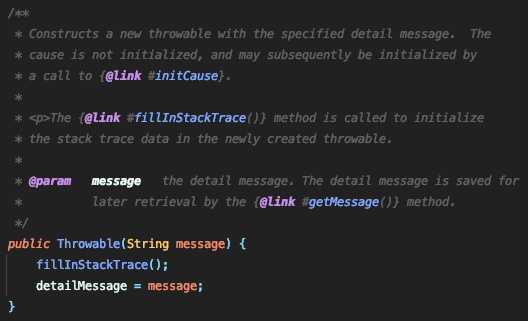
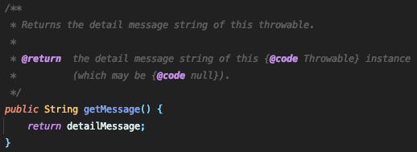

# 예외처리

## 프로그램 오류
프로그램 실행 중 어떤 원인에 의해 프로그램이 오작동 또는 비정상적 종료가 되는 경우가 있다. 이 때의 원인을 프로그램 오류 혹은 에러라고 한다.

발생시점에 따라 컴파일 에러, 런타임 에러, 논리적 에러로 구분할 수 있다.
### 컴파일 에러
**컴파일** : 개발 언어로 소스코드가 작성되어, 컴파일 과정을 통해 컴퓨터가 인식할 수 잇는 기계어 코드로 변환되어 실행 가능한 프로그램이 되는 과정


**컴파일 에러** : 컴파일 시 발생하는 에러로 요즘은 IDEA가 에러를 잡아준다.
코드 작성 시 `;`을 빼먹는다던지 `}` 괄호의 개수를 잘 못 맞춘 것 등이 컴파일 에러이다.

### 런타임 에러
**런타임** : 컴파일 과정을 마친 응용 프로그램이 사용자에 의해서 실행되어지는 '때(time)'를 의미

**런타임 에러** : 실행 시 발생하는 에러


ex) OutOfMemoryError, StackOverFlowError

### 논리적 에러
컴파일도 문제 없고 런타임 에러도 발생하지 않지만 사용자가 코드작성을 잘못하여 코드가 의도한 대로 작동하지 않는 것을 논리적 에러라고 한다.


## 에러(Error)와 예외(Exception)


자바에서는 Runtime 시 발생할 수 있는 프로그램 오류를 에러와 예외로 구분한다.


에러(Error)와 오류(Exception) 모두 Throwable **Class**를 구현한 클래스이다.
Throwable Class에는 printStaceTrace(), getStackTrace(), getMessage() 등의 메서드가 있다.


**에러** : 프로그램 코드에 의해 수습될 수 없는 심각한 오류
**예외** : 프로그램 코드에 의해 수습 가능한 다소 미약한 오류


에러 발생 시 프로그램의 비정상 종료를 막을 순 없지만 예외는 예외처리를 통해 프로그램의 비정상 종료를 막을 수 있다.

예외처리를 통해 프로그램의 비정상 종료를 막는 법을 알아보자.

### 예외
예외는 크게 Exception 클래스를 상속받은 클래스들을 말하며 크게 RuntimeException과 RuntimeException을 상속받은 클래스들(Unchecked Exception)과 그 외의 Exception(Checked Exception)으로 구분된다.

예외가 발생하면 에러가 발생한 메소드에서 에러 객체를 생성(new Exception())하여 런타임 시스템에 전달(Thorw)하게 됨.

런타임 시스템은 에러 객체를 처리할 수 있는 메소드를 Call Stack 메모리에서 찾음

적절한 예외 처리기를 찾으면 런타임 시스템은 예외를 통과함 → 예외로 인한 비정상 종료를 막음

예외 처리기를 찾지 못하면 런타임 시스템은 종료됨.


 
#### Exception (Checked Exception)
Checked Exception으로 예외처리를 해주지 않으면 컴파일 에러가 발생한다.
사용자의 실수와 같은 외적인 요인에 의해 발생될 수 있는 예외인 경우가 많다.


#### RuntimeException (Unchecked Exception)
Unchecked Exception으로 프로그래머가 예외처리를 하지 않아도 컴파일 에러가 발생하지 않는다. 주로 프로그래머의 실수에 의해서 발생될 수 있는 예외인 경우가 많다.

왜 RuntimeException은 Unchecked Exception인가?
만약 RuntimeException이 Checked Exception 이었다면 우리는 모든 코드에 예외처리를 해주어야 할 것이다. 프로그래머의 실수에 의해 발생하는 예외인 만큼 프로그래머가 주의하여 코드를 작성해 예외처리 없이 프로그래머가 편하게 코드를 작성하라는 자바개발자의 배려(?)인 것 같다.


| |검사 예외 Checked Exception|비검사 예외 Unchecked Exception|
|------|---|---|
|애플리케이션에서 예외 처리 여부|반드시 예외 처리 코드가 있어야 한다.|강제가 아니다.|
|예외의 확인 시점|컴파일 단계에서부터 컴파일이 되지 않는다.	|런타임 중 예외가 확인된다.|
|예외 발생시 트랜잭션 처리	| Roll-back 안함	| Roll-back|
|대표적인 클래스|IOException, SQLException| NullPointerException, IndexOutOfBoundException|||


## 예외처리 방법

### 직접 처리 (try-catch or try-with-resource)
#### try-catch
예외를 처리할 때 사용하는 구문

try block, catch block, finally block 등으로 구성됨

```java
try {
	// 오류를 발생할 수 있는 코드 (checked exception)
	// 예외 발생 시 발생된 예외 객체를 만듬
} catch (Exception1 e1) {
	// try block에서 생성된 예외 객체가 Exception1이면
	// e1이 예외 객체를 가르킴
	// Exception1 예외 객체가 발생 시 처리할 코드
} catch (Exception2 e2) {
	// try block에서 Exception2 가 발생 시 처리할 코드
} catch (Exception3 | Exception4 e34){
	// Exception3 or Exception4 인 경우
	// Exception3와 Exception4 가 부모-자손관계이면 안됨
	// 부모-자손관계일 시 부모가 예외를 다 잡기 때문에 자손 쓰는 이유가 없음
	// 참조변수 e34는 final이 선언되어 있음
} finally {
	// 에러가 발생해도 무조건 실행되어야 하는 코드
	// (try or catch 코드가 실행중일 때 JVM이 종료되면 실행안될수도)
	// 1. 예외 핸들러가 있을 때
	// try block -> catch block -> finally 순으로 실행
	// 2. 예외 핸들러가 없을 때 (쓰레드가 종료될 때)
	// try block -> finally -> 쓰레드 종료
}
```

#### try-with-resources
finally 블록에서는 보통 파일을 닫거나 자원을 복구하는 코드를 작성해 resource leak을 방지하게 된다. try-with-resources 는 `Closeable`을 가지고 있는 클래스들에 적용이 가능하며 close()를 try block에서 exit 할 때 호출함.

Example)
```java
import java.io.Closeable;
import java.io.IOException;

public class ExceptionTest {

    public static void main(String[] args) {
    // 여러개의 자원을 할당하는 경우 ; 세미콜론을 중간에 넣으면 된다.
    // 먼저 선언할수록 close() 순위는 뒤로 밀림
    // testClose1 close() 후 testClose close() 됨
        try(TestClose testClose = new TestClose();
            TestClose testClose1 = new TestClose()){
            testClose.start();
            int[] a = new int[2];
            a[3] = 10;            //에러발생
            testClose.end();
        } catch (Exception e) {
            System.out.println("에러다!");
        } finally {
	        System.out.println("try-with-resource 문도 finally block 가능");
        }
        System.out.println("메인문 종료");
    }
}

class TestClose implements Closeable {
    public void start() {
        System.out.println("프로그램 시작");
    }
    @Override
    public void close() throws IOException {
        System.out.println("Close가 호출됨");
    }
    public void end() {
        System.out.println("프로그램 종료");
    }
}
```
```
프로그램 시작
Close가 호출됨 // 하나는 testClose1의 close()
Close가 호출됨 // 하나는 testClose의 close()
에러다!
try-with-resource 문도 finally block 가능
메인문 종료
```

-   언제 close() 를 호출할까?
    -   try블럭에서 예외 발생 후 적절한 예외처리기 있는지 없는지 확인 후 close() 호출 예외처리기 있으면 예외처리기 실행 없으면 쓰레드 죽음.


### 예외 발생시키기 ( throw new Exception("예외 받아라!"); )
프로그래머가 예외를 발생시키는 이유 : 정보를 주기 위함.

프로그래머가 의도와 달리 비정상적으로 돌아가는 코드에서 예외를 발생시켜 프로그램이 잘못 실행되고 있다고 정보를 주기 위해 사용.

숫자가 20보다 크기를 원치 않을 경우 예외를 발생시켜 핸들할 수 있음.
```java
if (num > 20) {
	throw new Exception("숫자가 20보다 큽니다");
}
```
- 예외 클래스 생성자에 `String`을 넣어주면 예외 인스턴스에 `String`값이 메시지로 저장된다.

- 저장된 메시지는 `getMessage()`를 이용해서 얻어올 수 있다.



### 예외 던지기(throws CheckedException) // 예외 떠넘기기 // 책임 전가
메서드를 호출한 쪽으로 예외를 전달해 예외처리를 떠맡기는 방법.


### 예외 전환(감싸기)
`Checked` 예외를 `Unchecked` 예외로 변경하기 위해서 예외 전환을 사용한다.

  자바가 처음 개발되던 때와 환경이 많이 바뀌면서, 필수로 예외를 처리해야하는 `checked` 예외가 의미 없어지는 상황이 생기기 시작하였습니다.

  이런 경우에 의미없는 `try-catch`문을 추가하는 대신에 `unchecked` 예외인 `RuntimeException`의 원인 예외로 등록하여 감싸는 방법으로 `unchecked` 예외로 변경하여  예외처리를 하지 않을 수 있습니다.

```java
  void install() throws InstallException {
    try {
      startInstall();
      copyFiles();
    } catch (Exception1 e) {
      throw new RuntimeException(new Exception1)
    } catch (Exception2 e) {
      throw new RuntimeException(new Exception2)
    } catch (Exception3 e) {
      throw new RuntimeException(new Exception3)
    } catch (Exception4 e) {
      throw new RuntimeException(new Exception4)
    } catch (Exception5 e) {
      throw new RuntimeException(new Exception5)
    }
  }
```


### 커스텀 예외 (사용자 예외)
자바에서 제공하는 표준 예외 클래스 이외에 프로그래머가 직접 예외 클래스를 만들어 예외 상황을 처리할 수 있다. 이를 커스텀 예외(사용자 예외)라고 한다.

#### 만드는 방법
만들기 전에 Checked Exception으로 할 것인가 Unchecked Exception으로 할 것인지 결정해야 한다.
```java
public class ExampleException extends RuntimeException {
	public ExampleException() {
		super();
	}

	public ExampleException(String message) {
		super(message);
	}
}
```


#### 왜 커스텀 예외를 사용할까?
1. 예외클래스 명 만으로 정보 전달이 가능


2. 상세한 예외 정보를 제공할 수 있음


#### 커스텀 예외가 무조건 좋은 것인가?

커스텀 예외의 사용에 반대하는 의견들도 많다.

1. 예외 메시지로도 충분히 의미를 전달할 수 있다.  
   1. 메시지만 예외사항에 맞게 재정의해준다면 충분히 그 의미를 파악할 수 있다.  
  
2. 표준 예외를 사용하면 가독성이 높아진다.  
   1. 우리는 이미 익숙하고, 쓰임에 대해 잘 알고있는 예외들이 많다.
   2. 낯선 예외를 만났을 땐, 그 커스텀 익셉션을 파악하는 작업이 따라온다. 이 또한 비용이 될 수 있다.

3. 일일히 예외 클래스를 만들다보면 지나치게 커스텀 예외가 많아질 수 있다.
   1. 예외 클래스들을 하나하나 만들다보면 지나치게 많아질 수 있다. 이 디렉토리와 클래스를 관리하는 것 역시 일이다.

Effective Java에서도 아래와 같은 이유로 표준 예외 사용을 권장하고 있다.

1. 배우기 쉽고 사용하기 편리한 API를 만들 수 있다.
2. 표준 예외를 사용한 API는 가독성이 높다.
3. 예외도 재사용하는 것이 좋다. 예외 클래스의 수가 적을수록 프로그램의 메모리 사용량이 줄고, 클래스를 적재 시간도 줄어든다.


