# fork🍴에서 PR(Pull Request)까지

코드스쿼드 코코아 과정이 시작되면서 팀원들에게 코드리뷰용 공동 레포지토리를 만들어보자고 제안을 해봤다. 개인 미션도 빡센데 너무 욕심부리는건 아닐까 걱정했는데, 다들 흔쾌히 응해주셨다👍

나도 그렇고 팀원들도 그렇고 `협업`으로 `git`을 사용해본 일이 거의 없기 때문에 [초보몽키님의 블로그 글](<[https://wayhome25.github.io/git/2017/07/08/git-first-pull-request-story/](https://wayhome25.github.io/git/2017/07/08/git-first-pull-request-story/)>) 링크를 일단 드렸는데, `Fork` 떠서 `PR`을 생성하는 과정에서 여러 문제가 생겼다. 나도 `git`을 잘 다룰줄 모르고, 데일리 미션들이 너무 빡세서 그럼 일단 `fork` 하지 말고 원본을 `clone`해서 해보시라는 답변밖에 드릴 수 없었다😭

그래서 미션이 없는 금요일을 맞이하여,

- 다음주에 다시 바뀌게 될 조에서 또 공동 리포지토리를 사용할진 모르겠지만 만약을 대비해서
- 오픈소스에 기여하고 싶은 누군가를 위해

다른 프로젝트를 fork하고 pr까지 날려보며 매뉴얼을 한번 작성해보고자 한다.

~~(내가 ⭐ 해둔 저장소 중에 당장 PR을 날려볼 수 있는 [Awesome Sushi] 프로젝트를 선택해보았다.)~~

---

## 1. fork

- PR을 보내고 싶은 타켓 Repository를 자신의 저장소로 fork한다.
  - 타켓 Repository의 우측 상단에서 Fork 버튼 클릭
    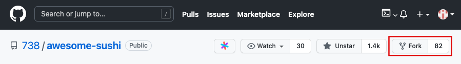
  - Fork 완료!
    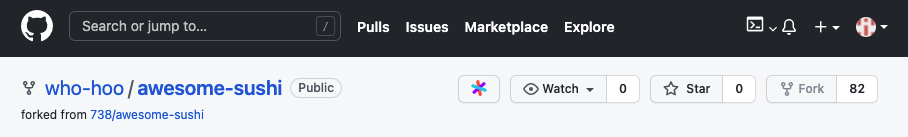

## 2. clone

- fork된 본인 계정의 저장소를 clone - `git clone [clone할 repository url]`
  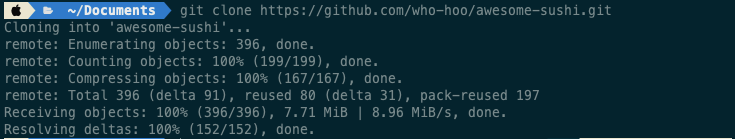

## 3. remote(원격 저장소) 추가

- 현재 remote설정이 fork된 본인 계정의 저장소로 되어있기 때문에 PR을 보내고 동기화(pull)할 원격 저장소의 추가가 필요하다.
  - 원격 저장소 설정 상태 확인 - `git remote -v`
    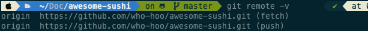
    - `origin`이라는 이름으로 기본으로 추가되어 있다.
- PR을 보낼 타겟 Repository를 remote로 추가한다.
  - remote 추가
    ```bash
    git remote add [(내가 정할)원본 프로젝트 저장소의 별명] [원본 프로젝트 저장소의 url]
    ```
    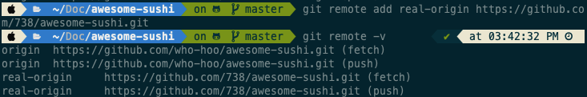
    - 나의 경우에는 일단 원본 프로젝트 저장소의 별명을 임의로 `real-origin`으로 정해주었다.
      - 나중에 찾아보니 `upstream`으로 많이들 하시는 것 같다.
    - 추가 후에 다시 `git remote -v`를 실행하면 `real-origin`이라는 이름으로 remote가 추가된 것을 확인할 수 있다.

## 4. branch 생성과 이동

- 코드 동기화 - `git pull [원본 프로젝트 저장소 별명] [브랜치명]`
  - 포크해서 맨 처음에 브랜치를 생성할 때에는 저장소가 최신인 상태이므로 이 단계는 진행하지 않아도 괜찮다. 다시 추가작업을 할때 코드를 동기화한다!
  - 나의 경우에는 위에서 `real-origin`으로 추가를 해두었으므로, `git pull real-origin`를 실행했다.
    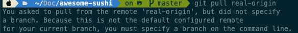
  - `real-origin`에서 브랜치를 지정 안해줘서 실행이 안됐다. 원본 저장소의 `master(main일수도 있고 다 다르니까 저장소에 가서 직접 확인하자)` 브랜치명을 명시해서 다시 실행한다.
    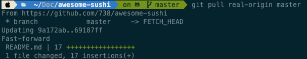
    - 디폴트로 정해둘수있는 방법이 있을까? 나중에 찾아보자ㅎㅎ
  - 원본 저장소에서 땡겨온거 내 저장소에 push - `git push origin`
    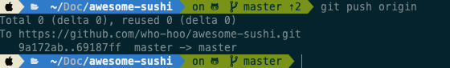
- 작업을 진행할 branch를 생성한다.
  - branch 목록 확인 - `git branch`
    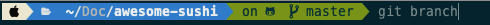
      
    생성되어있는 브랜치 목록을 확인할 수 있다 `q`를 눌러서 나간다.
  - branch 생성 - `git branch [생성할 브랜치명]`
    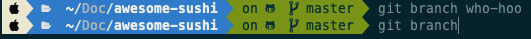
    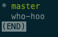
    - 실행후 다시 `git branch` 명령으로 목록을 확인하니 `who-hoo`라는 브랜치가 성공적으로 생성되었다.
    - 현재 \* master 이렇게 되어있는데 지금 내가 master 브랜치 위에 있다는 것을 의미한다.
  - branch 이동(변경) - `git checkout [이동할 브랜치명]`
    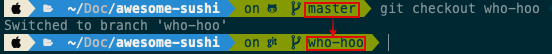
    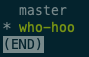
    - 브랜치가 성공적으로 이동(변경)되었다.
  - +) `git checkout -b [생성할 브랜치명]` 커맨드로 브랜치의 생성과 이동을 동시에 할수도 있다
  - +) 보통은 프로젝트마다 [CONTRIBUTING.md](https://github.com/738/awesome-sushi/blob/master/CONTRIBUTING.md) 파일에 기여 방법이 정해져있다. 기여하고싶은 오픈소스가 있다면 먼저 확인해 볼 것!

## 5. 작업완료 후 push

- 작업을 완료하고 `commit`까지 완료한 후에, `push`를 통해 변경사항을 remote에 반영한다.
  ```bash
  git push [push할 원격 저장소의 별명] [branch명]
  ```
  - 나의 github repository에 반영
    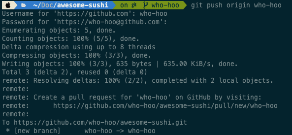

## 6. PR 생성

- 활성화 된 `Compare & pull request` 버튼을 클릭하여 PR을 생성한다.
  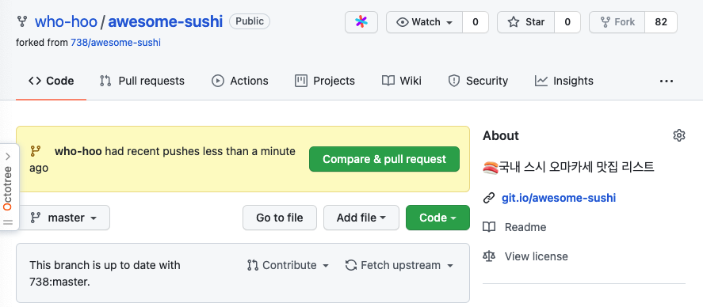
- 컨벤션에 맞게 PR을 작성하고, `Create pull request`를 클릭한다.
  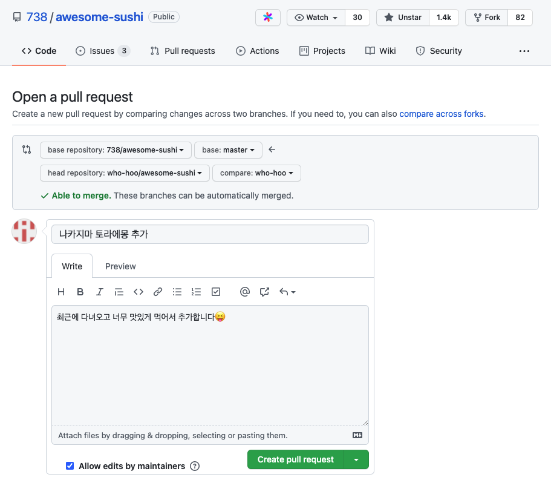

## 7. Review & Merge

- 리뷰 진행 후, Merge를 진행해도 괜찮겠다 싶으면 Merge한다.
  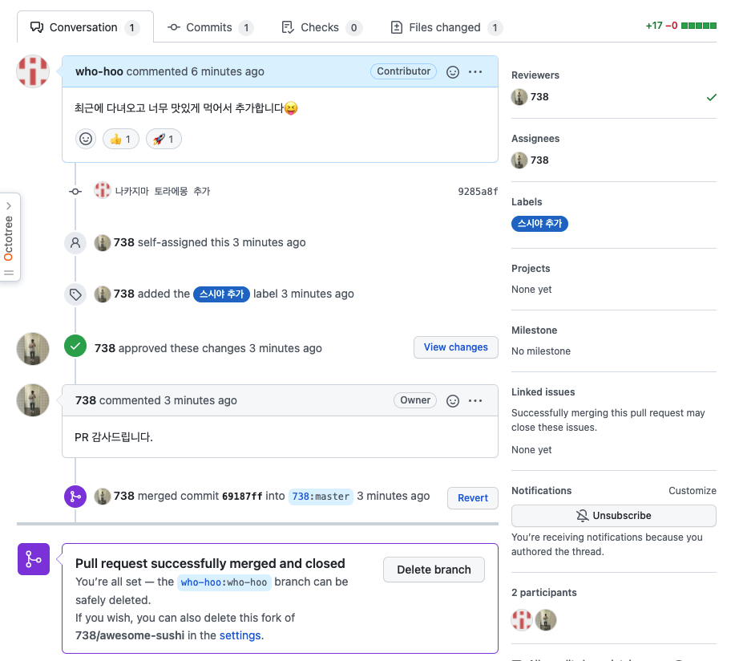
  - 원본 저장소에서 부여받은 권한에 따라 본인이 `merge`를 하거나 관리자가 `merge`한다.
  - `merge`가 완료되면 `Delete branch` 버튼을 클릭해서 원본 저장소에 생성된 브랜치를 삭제해준다.

## 8. 작업이 완료된 branch 삭제

- 성공적으로 원본 저장소에 반영(`merge`)이 완료되었으므로, [동기화](#코드_동기화)를 한번 해준 후, 작업이 완료된 브랜치(로컬에 있는)를 삭제한다. - `git branch -d [브랜치명]`
  ```bash
  git branch -d [브랜치명]
  ```
  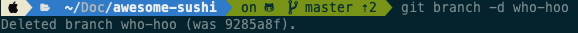

## 9. 다시 작업할 일이 생기면...

- [4번](#4._branch_생성과_이동)으로 돌아가 반복한다.
