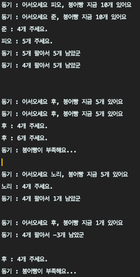

# 쓰레드의 동기화(synchronization)

쓰레드의 동기화가 무엇인지와 `synchronized` 키워드를 이용한 동기화 방법에 대해 정리하였습니다.

## 1. 동기화

멀티쓰레드 프로세스의 경우, 동일한 프로세스 내에서 쓰레드들은 모두 하나의 메모리를 공유하기 때문에 정합성이 깨지는 문제가 발생할 수 있습니다.

```java
class BungeobbangStore {

    private int bakedBungeobbang = 10;

    public int getBakedBungeobbang() {
        return bakedBungeobbang;
    }

    public void sell(String customer, int count) {
        System.out.println("동기 : 어서오세요 " + customer + ", 붕어빵 지금 " + bakedBungeobbang + "개 있어요");
        System.out.println(customer + " : " + count + "개 주세요.");

        if (bakedBungeobbang < count) {
            System.out.println("동기 : 붕어빵이 부족해요...");
            System.out.println();
            return;
        }
        try {
            Thread.sleep(3000);
        } catch (InterruptedException e) {
        }

        bakedBungeobbang -= count;
        System.out.println("동기 : " + count + "개 팔아서 " + bakedBungeobbang + "개 남았군");
        System.out.println();
    }
}

class Order implements Runnable {

    BungeobbangStore store = new BungeobbangStore();

    List<String> customers = Arrays.asList("노리", "준", "피오", "후");

    public void run() {
        while(store.getBakedBungeobbang() > 0) {
            String customer = customers.get((int)(Math.random()* customers.size()));
            store.sell(customer, (int)(Math.random()*10 +1));
        }
    }
}

class ThreadEx {

    public static void main(String[] args) {
        Runnable order = new Order();
        new Thread(order).start();
        new Thread(order).start();
    }
}
```



> 좀비처럼 몰려든 손님들의 주문으로 고장나버린 동기의 모습

이런 일을 방지하기 위해서 한 쓰레드가 진행중인 작업을 다른 쓰레드가 간섭하지 못하도록 막는 것을 쓰레드의 동기화(synchronization)라고 합니다.

## 2. 임계 영역(critical section)과 잠금(락, lock)

한 쓰레드가 특정 작업을 끝마치기 전까지 다른 쓰레드에 의해 방해받지 않도록 하기 위해 도입된 개념이
바로 `임계 영역(critical section)`과 `잠금(락, lock)`입니다.  
동기화하려면 간섭받지 않아야 하는 문장들(공유 데이터를 사용하는 코드 영역)을 임계 영역으로 설정해야 합니다.
이 임계영역은 락을 얻은 단 하나의 쓰레드만 수행할 수 있습니다. 객체 1개에 락 1개가 존재하며 다른 쓰레드들은 락을 얻을 때까지 기다려야 합니다.


> 임계영역에 들어가고 싶으면 락(출입증)부터 보여달라구

## 3. `synchronized`를 이용한 동기화

저는 동기화 방법으로 `synchronized` 키워드를 이용한 동기화에 대해 정리하였습니다.
JDK1.5부터 이 외에도 동기화를 구현하는 다양한 방법을 지원하고 있다고 하는데 이는 `Jun`이 잘 정리해 줄 것 입니다.

`synchronized` 키워드는 임계 영역을 설정하는데 사용되는데요, 임계영역을 지정하는데에는 두 가지 방식이 있습니다.

1. 메서드 전체를 임계영역으로 지정(synchronized method)
   - 메서드 앞에 `synchronized`를 붙인다.
   - synchronized 메서드가 호출된 시점부터 해당 메서드가 포함된 객체의 lock을 얻어 작업을 수행하다가 메서드가 종료되면 lock을 반납
   - synchronized 메서드 내에서 다른 synchronized 메서드를 호출 X (deadlock 방지)
2. 특정한 영역을 임계영역으로 지정(synchronized block)
   - 메서드 내의 코드 일부를 블럭`{}`으로 감싸고 블럭 앞에 `synchronized(참조변수)`를 붙인다.
   - 참조변수는 락을 걸고자하는 객체를 참조하는 것이어야 한다.
   - 이 블럭의 영역 안으로 들어가면서부터 쓰레드는 지정된 객체의 lock을 얻게 되고 블럭을 벗어나면 lock을 반납

이 임계영역은 멀티쓰레드 프로그램의 성능을 좌우하기 때문에 가능하면 메서드 전체에 락을 걸기 보다는 `synchronized block`으로
임계영역을 최소화하는 것이 좋다고 합니다.
