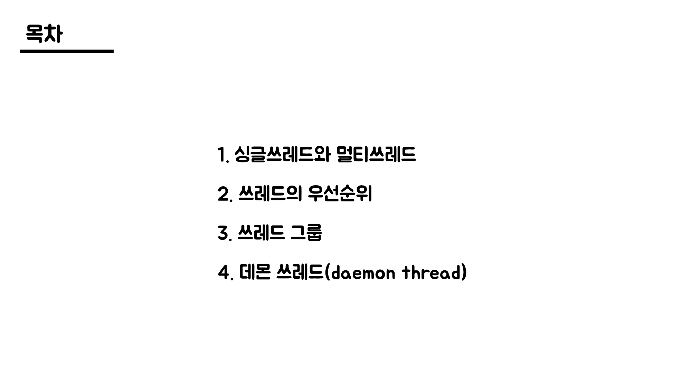
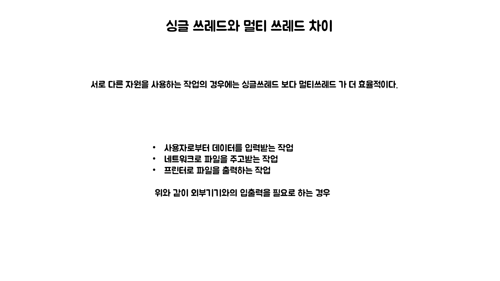
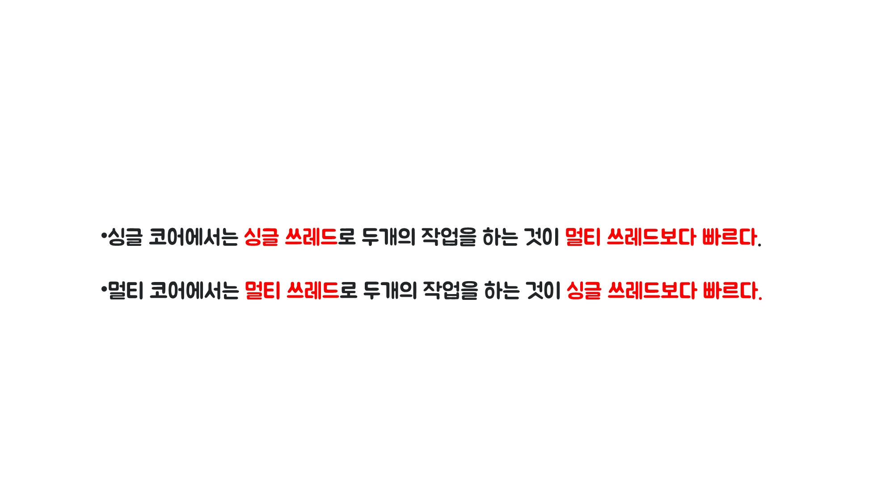
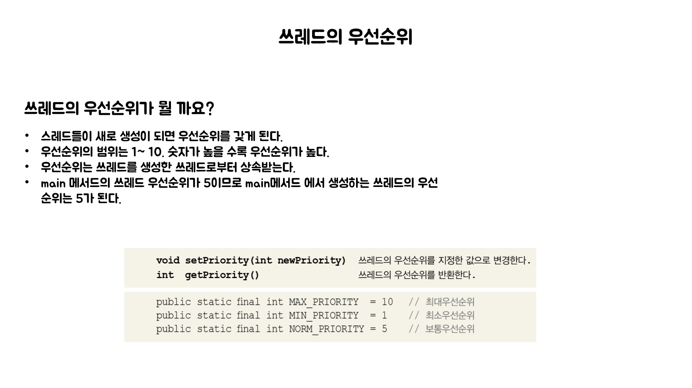
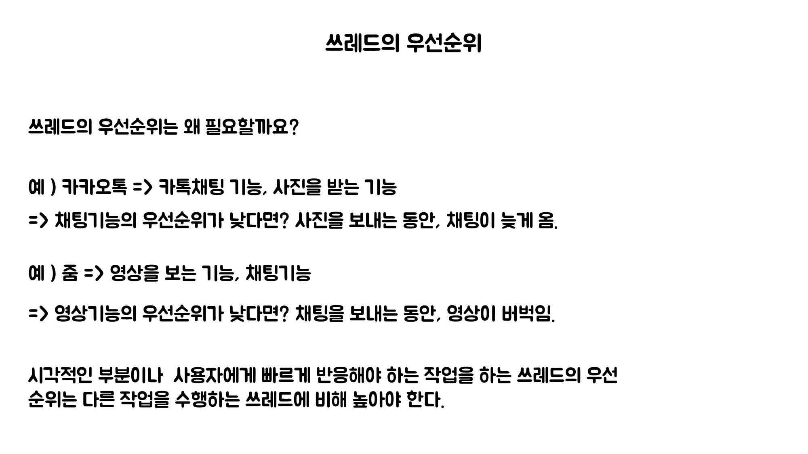

# 노리의 쓰레드

#### 싱글 쓰레드와 멀티 쓰레드의 차이





#### 싱글쓰레드
```java
public class SingleThread {
    public static void main(String[] args) {
        long startTime = System.currentTimeMillis();

        for(int i=0; i < 500; i++) {
            System.out.printf("%s", new String("-"));
        }

        System.out.println("소요시간1:" +(System.currentTimeMillis()- startTime));

        for(int i=0; i < 500; i++){
            System.out.printf("%s", new String("|"));
        }

        System.out.println("소요시간2:"+(System.currentTimeMillis() - startTime));
    }
}

```
#### 멀티쓰레드
```java
public class MultiThread {
    static long startTime = 0;

    public static void main(String args[]) {
        MultiThread_1 th1 = new MultiThread_1();
        th1.start();
        startTime = System.currentTimeMillis();

        for (int i = 0; i < 500; i++) {
            System.out.printf("%s", new String("-"));
        }

        System.out.println("소요시간1:" + (System.currentTimeMillis() - startTime));
    }
}

class MultiThread_1 extends Thread {
    public void run() {
        for (int i = 0; i < 500; i++) {
            System.out.printf("%s", new String("|"));
        }

        System.out.println("소요시간2:" + (System.currentTimeMillis() - MultiThread.startTime));
    }
}
```




#### 싱글스레드 사용자 입력
```java
public class SingleThreadIO {
    public static void main(String[] args) throws Exception {
        String input = JOptionPane.showInputDialog("값을 입력하세요.");
        System.out.println("입력하신 값은 " + input + "입니다.");

        for (int i = 10; i > 0; i--) {
            System.out.println(i);
            try {
                Thread.sleep(1000);
            } catch (Exception e) {
            }
        }
    }
}
```

#### 멀티스레드 사용자 입력
```java
public class MultiThreadIO {
    public static void main(String[] args) throws Exception 	{
        MultiThreadIO_1 th1 = new MultiThreadIO_1();
        th1.start();

        String input = JOptionPane.showInputDialog("값을 입력하세요.");
        System.out.println("입력하신 값은 " + input + "입니다.");
    }
}

class MultiThreadIO_1 extends Thread {
    public void run() {
        for(int i=10; i > 0; i--) {
            System.out.println(i);
            try {
                sleep(1000);
            } catch(Exception e ) {}
        }
    }
}
```






#### 쓰레드 우선순위
```java
public class Priority {
    public static void main(String args[]) {
        Priority_1 th1 = new Priority_1();
        Priority_2 th2 = new Priority_2();

        th2.setPriority(10);

        System.out.println("Priority of th1(-) : " + th1.getPriority());
        System.out.println("Priority of th2(|) : " + th2.getPriority());
        th1.start();
        th2.start();
    }
}

class Priority_1 extends Thread {
    public void run() {
        for (int i = 0; i < 1000; i++) {
            System.out.print("-");
        }
    }
}

class Priority_2 extends Thread {
    public void run() {
        for (int i = 0; i < 1000; i++) {
            System.out.print("|");
        }
    }
}
```

