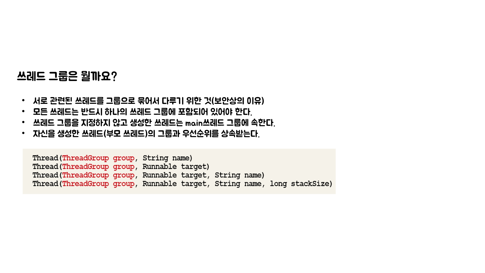
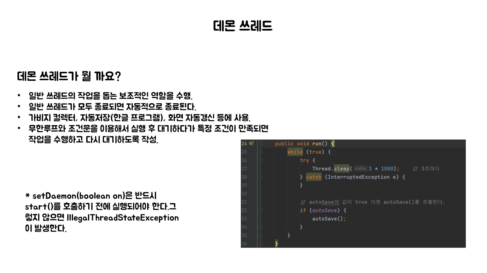

# 노리의 쓰레드

#### 싱글 쓰레드와 멀티 쓰레드의 차이


#### 싱글쓰레드

```java
public class SingleThread {
    public static void main(String[] args) {
        long startTime = System.currentTimeMillis();

        for(int i=0; i < 500; i++) {
            System.out.printf("%s", new String("-"));
        }

        System.out.println("소요시간1:" +(System.currentTimeMillis()- startTime));

        for(int i=0; i < 500; i++){
            System.out.printf("%s", new String("|"));
        }

        System.out.println("소요시간2:"+(System.currentTimeMillis() - startTime));
    }
}
```
#### 멀티쓰레드

```java
public class MultiThread {
    static long startTime = 0;

    public static void main(String args[]) {
        MultiThread_1 th1 = new MultiThread_1();
        th1.start();
        startTime = System.currentTimeMillis();

        for (int i = 0; i < 500; i++) {
            System.out.printf("%s", new String("-"));
        }

        System.out.println("소요시간1:" + (System.currentTimeMillis() - startTime));
    }
}

class MultiThread_1 extends Thread {
    public void run() {
        for (int i = 0; i < 500; i++) {
            System.out.printf("%s", new String("|"));
        }

        System.out.println("소요시간2:" + (System.currentTimeMillis() - MultiThread.startTime));
    }
}
```


#### 싱글스레드 사용자 입력

```java
public class SingleThreadIO {
    public static void main(String[] args) throws Exception {
        String input = JOptionPane.showInputDialog("값을 입력하세요.");
        System.out.println("입력하신 값은 " + input + "입니다.");

        for (int i = 10; i > 0; i--) {
            System.out.println(i);
            try {
                Thread.sleep(1000);
            } catch (Exception e) {
            }
        }
    }
}
```

#### 멀티스레드 사용자 입력

```java
public class MultiThreadIO {
    public static void main(String[] args) throws Exception 	{
        MultiThreadIO_1 th1 = new MultiThreadIO_1();
        th1.start();

        String input = JOptionPane.showInputDialog("값을 입력하세요.");
        System.out.println("입력하신 값은 " + input + "입니다.");
    }
}

class MultiThreadIO_1 extends Thread {
    public void run() {
        for(int i=10; i > 0; i--) {
            System.out.println(i);
            try {
                sleep(1000);
            } catch(Exception e ) {}
        }
    }
}
```


#### 쓰레드 우선순위

```java
public class Priority {
    public static void main(String args[]) {
        Priority_1 th1 = new Priority_1();
        Priority_2 th2 = new Priority_2();

        th2.setPriority(10);

        System.out.println("Priority of th1(-) : " + th1.getPriority());
        System.out.println("Priority of th2(|) : " + th2.getPriority());
        th1.start();
        th2.start();
    }
}

class Priority_1 extends Thread {
    public void run() {
        for (int i = 0; i < 1000; i++) {
            System.out.print("-");
        }
    }
}

class Priority_2 extends Thread {
    public void run() {
        for (int i = 0; i < 1000; i++) {
            System.out.print("|");
        }
    }
}
```




#### 쓰레드 그룹

```java
public class Group {
    public static void main(String args[]) throws Exception {
        ThreadGroup main = Thread.currentThread().getThreadGroup();
        ThreadGroup grp1 = new ThreadGroup("Group1");
        ThreadGroup grp2 = new ThreadGroup("Group2");

        // ThreadGroup(ThreadGroup parent, String name)
        ThreadGroup subGrp1 = new ThreadGroup(grp1,"SubGroup1");

        grp1.setMaxPriority(3);	// 쓰레드 그룹 grp1의 최대우선순위를 3으로 변경.

        Runnable r = new Runnable() {
            public void run() {
                try {
                    Thread.sleep(1000); // 쓰레드를 1초간 멈추게 한다.
                } catch(InterruptedException e) {}
            }
        };

        // Thread(ThreadGroup tg, Runnable r, String name)
        Thread th1 = new Thread(grp1,     r, "th1");
        Thread th2 = new Thread(subGrp1,  r, "th2");
        Thread th3 = new Thread(grp2,     r, "th3");

        th1.start();
        th2.start();
        th3.start();

        System.out.println(">>List of ThreadGroup : "+ main.getName()
                +", Active ThreadGroup: " + main.activeGroupCount()
                +", Active Thread: "      + main.activeCount());
        main.list();
    }
}
```




#### 데몬 쓰레드

```java
public class Daemon implements Runnable {
    static boolean autoSave = false;

    public static void main(String[] args) {
        Thread t = new Thread(new Daemon());
        t.setDaemon(true);        // 이 부분이 없으면 종료되지 않는다.
        t.start();

        for (int i = 1; i <= 10; i++) {
            try {
                Thread.sleep(1000);
            } catch (InterruptedException e) {
                e.getMessage();
            }
            System.out.println(i);

            if (i == 5)
                autoSave = true;
        }

        System.out.println("프로그램을 종료합니다.");
    }

    public void run() {
        while (true) {
            try {
                Thread.sleep(3 * 1000);    // 3초마다
            } catch (InterruptedException e) {
            }

            // autoSave의 값이 true 이면 autoSave()를 호출한다.
            if (autoSave) {
                autoSave();
            }
        }
    }

    public void autoSave() {
        System.out.println("작업파일이 자동 저장되었습니다.");
    }
}
```
