# 쓰레드의 실행제어

효율적인 멀티쓰레드 프로그램을 만들기 위해서는 쓰레드 스케줄링을 통해 멀티쓰레드 프로그램의 자원과 시간을 잘 사용해야 한다. 

## 1. 쓰레드의 상태와 생명주기
* 쓰레드의 상태

|상태|설명|
|---|---|
|NEW|쓰레드가 생성되었으나 아직 start()가 미호출된 상태|
|RUNNABLE|실행 또는 실행 가능 상태|
|BLOCKED|동기화블럭에 의해 일시정지된 상태(lock이 풀리기까지 기다리는 상태)|
|WAITING, TIMED_WAITING|쓰레드의 작업이 종료되지 않았지만 실행가능하지 않은 일시정지 상태(sleep, wait, join 메서드에 의해 발생). TIMED_WATING은 일시정지기간이 지정된 경우|
|TERMINATED|쓰레드의 작업이 종료된 상태|

 

* 쓰레드 생성 ~ 소멸 과정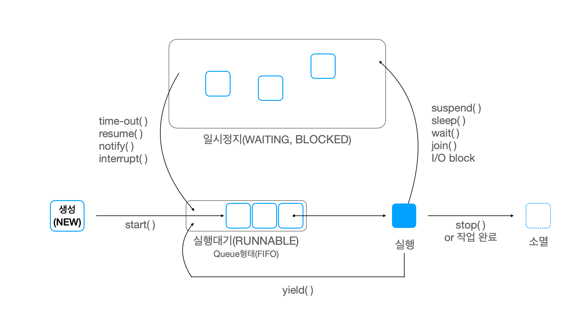

  

## 2. 쓰레드 스케줄링 메서드
###sleep(long millis)
* 지정한 시간동안 쓰레드를 멈추게 함. 

 

sleep()에 의해 일시정지 상태(WAITING)가 된 쓰레드는 지정된 시간이 다 되거나, sleep도중 interrupt()가 호출되면
실행 대기 상태(RUANNABLE)가 된다.

sleep중인 쓰레드에 interrupt()가 호출되면 InterruptedException이 발생되므로 sleep()호출부에는
항상 try-catch문으로 예외처리를 한다.

이때 문제가 있어서 try catch로 예외처리를 하는 게 아니라, try catch로
쓰레드를 깨우기 위한 것 뿐이라서 catch블록에 딱히 어떤 예외처리 작업을 해주지 않아도 된다

    //쓰레드 클래스
    public class ClockThread extends Thread {
        Clock clock = new Clock();

        @Override
        public void run() {
            clock.print();

            try {
                Thread.sleep(5 * 1000);
            } catch (InterruptedException e) {..아무것도 안해도 ok..}
        }
    }

    //Shell 클래스
    private void clock(String flag) throws InterruptedException {
        if (flag.equals("-s")) {
          clockThread = new Thread(new ClockThread());
          clockThread.setDaemon(true);
          clockThread.start();
        }

        if (flag.equals("-q")) {
          //sleep중인 clockThread를 interrupt로 깨워 실행대기상태(RUNNABLE)로 만든다.
          clockThread.interrupt(); 
        }
    }

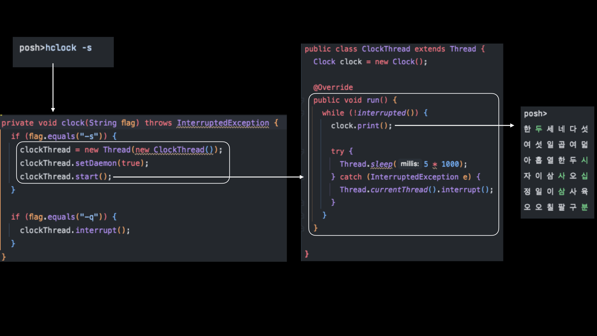

참고로 sleep()메서드를 호출할 때 쓰레드 참조변수로 메서드를 호출하는 것보다,
Thread.sleep()으로 호출하는 게 더 좋다. sleep()은 항상 현재 실행중인 쓰레드에
작동되기 때문에 오해의 여지를 줄이기 위해 특정 인스턴스에 대해 호출하는 듯한 코드를 
작성하지 않는 편이 좋겠다.

  
### interrupt()
* 특정 쓰레드에게 작업 중단을 요청하는 메서드이며, 쓰레드의 interrupted 상태를 변경시킨다.
* sleep중인(WAITING 상태인) 쓰레드에 InterruptedException예외를 발생시켜 실행 대기 상태(RUNNABLE)로 바꾸는 기능도 한다.
  
 

suspend(), stop()은 deprecated 되었기 때문에 자바에서는 사실상 쓰레드를 강제로 중단하는 방법이 없다. 
그래서 쓰레드를 중단시키기 위해서는 interrupt()를 사용해야 한다. 

다만 interrupt도 쓰레드를 강제적으로 중단시키는 것은 아니고, 작업 중단을 요청한 쓰레드의 interrupted라는
변수 상태를 바꾸는 것 뿐이기 때문에 추가적인 작업이 필요하다.

 

#### 사용법
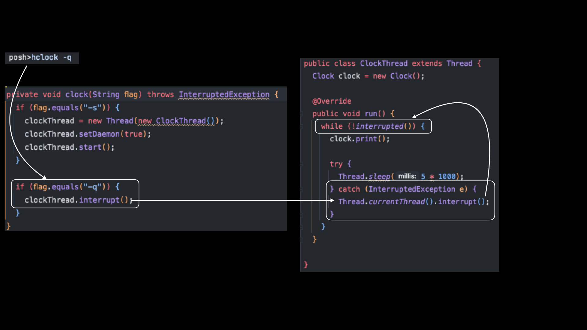

위 그림에서 interrupt()를 사용하는 과정을 살펴보자.
1. clock메서드에서 한글 시계를 출력하는 쓰레드 인스턴스에 interrupt()를 호출한다.
2. 만약 출력 쓰레드가 sleep중이라면 InterruptException에러가 발생하여 catch 문에 진입한다.
3. catch문에서 쓰레드 자기자신에게 interrupt()를 재호출하여 interrupted 인스턴스 변수 상태를 변경한다.
4. while문이 변경된 interrupted 값을 감지하여 while문을 탈출하고 쓰레드가 종료된다.

  

### suspend() resume() stop()
* suspend()는 sleep()처럼 쓰레드를 일시정지시킨다( -> WAITING ).
* resume()은 suspend된 쓰레드를 다시 RUNNABLE상태로 만든다.
* stop()은 쓰레드를 종료시킨다.

 

❌ suspend(), stop()은 deprecated된 메서드입니다. 
사용시 교착상태(deadlock)에 빠질 가능성이 높으므로 사용하지 않을 것을 권장합니다.

#### 교착 상태란?
멀티 쓰레드 프로그래밍에서는 동기화를 통해 락을 획득하여 동일한 자원을 여러 곳에서 함부로 사용하지 못하도록 한다.
하지만 두 개의 쓰레드에서 서로가 가지고 있는 락이 해제되기만을 무한정 기다리며 아무 작업도 수행하지 못하는
상황이 발생할 수 있는데, 이러한 상태를 교착상태(deadlock)라고 한다다.

 

#### 사용법

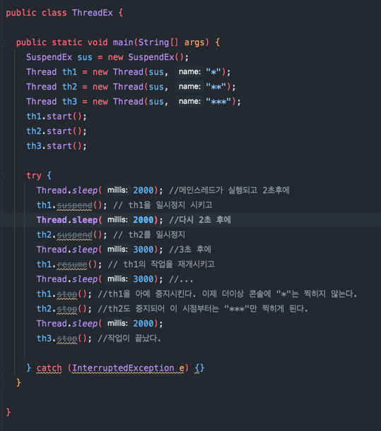
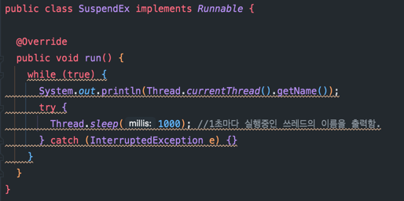

 
suspend와 stop의 원래 사용방법은 위와 같지만, deprecated되었으므로 아래와 같은 방식으로 사용한다.

  

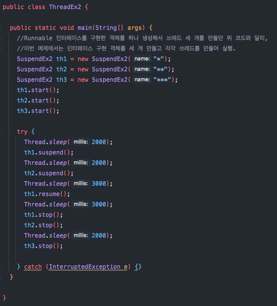

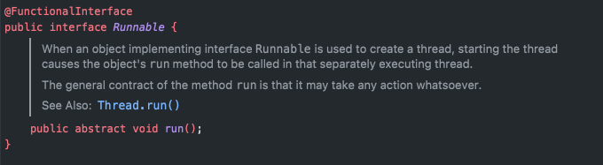
 

  

### 3. yield()
* 다른 쓰레드에게 자신의 실행시간을 양보한다(나누어준다).

 

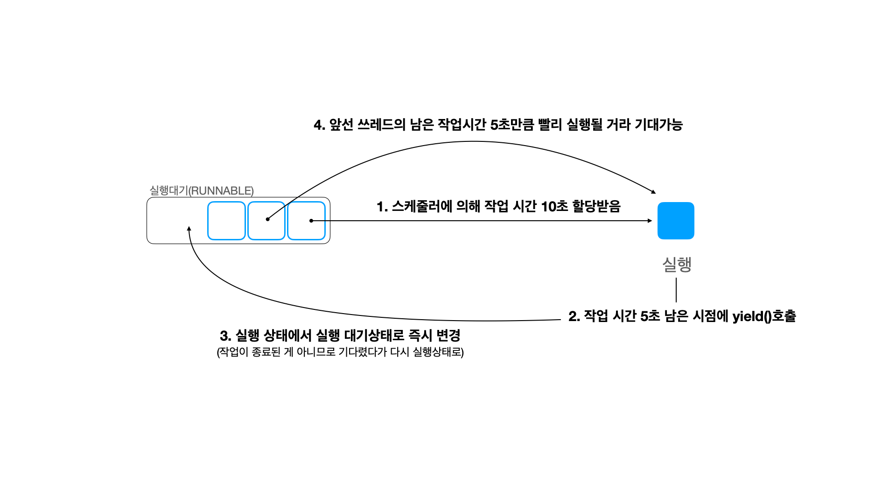

  
쓰레드는 스케줄러에 의해 실행시간을 할당받고 작업을 수행한다. 이때 쓰레드가 작업 도중 yield()를 호출하면, 아직 자신에게 할당된 남은 시간을
다른 쓰레드에게 넘겨줄 수 있다. 그리고 쓰레드 자기 자신은 실행대기(RUNNABLE)상태가 된다.

앞서 소개한 suspend와 같은 메서드를 쓰면 작업을 일시정지 시킬 수는 있지만, 일시정지된 쓰레드에게 주어진 시간은 계속 흘러간다(이러한 상태를 busy-wating상태라고 한다).
이 흘러가는 시간이란 자원을 효율적으로 쓸 수 있도록 해주는 게 yeild()메서드이다.

(그림에서는 yield호출 시점에 남은 시간만큼 다음 작업이 빨리 시작된다고 설명했지만, 쓰레드의 실행 시점은 OS의 스케줄러가
정하는 것이기 때문에 대기중인 쓰레드가 사실 정확히 5초 빨리 실행된다고는 장담할 수 없다.)

  

#### 사용법
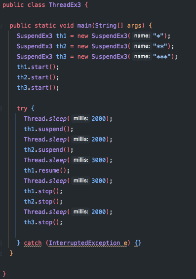

 

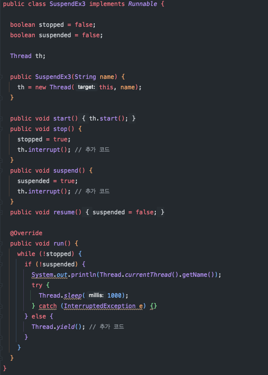

suspend 예제에서 SuspendEx 클래스에만 딱 세 줄이 추가되었다(ThreadEx는 동일). 
실행중인 쓰레드에 suspend()를 호출했을 때, 우리는 쓰레드가 수행하는 getName()작업을 일시정지시킬 수 있다. 
하지만 suspend예제에서는 while문을 탈출하지 못하고, 자기에게 주어진 시간을 아무 작업을 수행하지 않고 흘려보냈다. 
위 코드에서는 suspend()가 호출된 경우 Thread.yield()를 호출하여 자신에게 주어진 남은 시간을 다른 쓰레드에게 양보하고 곧바로 실행대기 큐로 들어간 것이다.

 
그런데 이때 한 가지 문제가 더 있는데, suspend()나 stop()을 호출한 시점에 이 쓰레드가 sleep중일 수 있다는 것이다. 
이 쓰레드는 남은 sleep시간이 다 끝나고 나서야 suspend, stopped 인스턴스 변수의 값이 바뀌었는지 확인할 것이고, 
그만큼 yield() 또는 쓰레드를 종료하는 시간이 늦춰질 것이다.

  

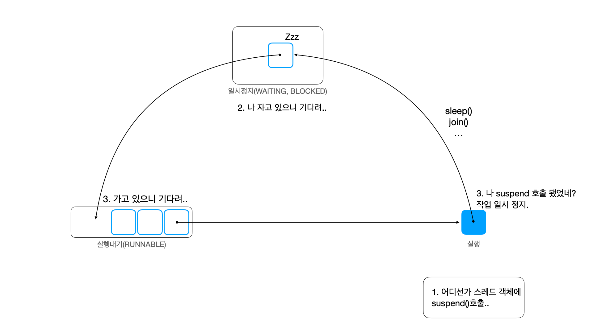

 

이러한 텀을 없애기 위해서 예제에서는 suspend()와 stop()메서드에 interrupt()호출 문장을 추가했다. 
만약 suspend(), stop()이 호출된 시점에 쓰레드가 잠들어있다면 interrupt()로 곧장 깨워서 예외를 발생시킨 후, 
yield()든 쓰레드 종료든 즉각 반응할 수 있게 해준 것이다.

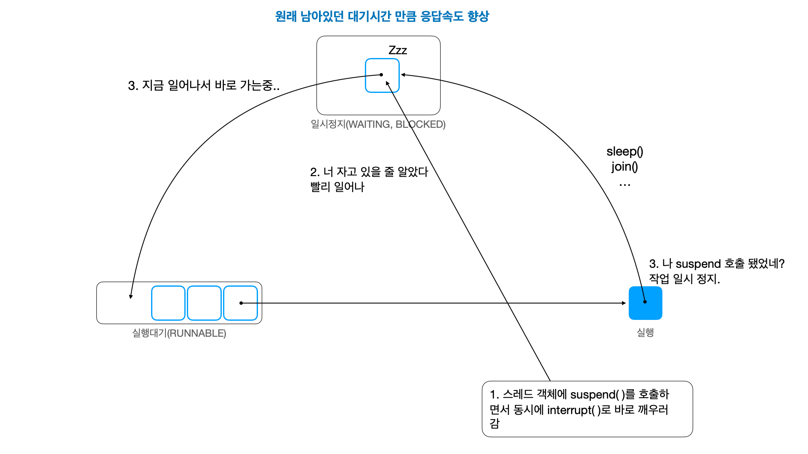

 

ThreadEx3는 suspend(), stop()에 interrupt()를 추가했기 때문에 실행시켜보면 별이 거의 정확히 1초마다 찍히지만,
ThreadEx2는 실행시켜보면 미세하게 출력 시간이 일정하지 않은 걸 확인할 수 있다. 이는 남아있는 sleep시간을 기다려줘서 그렇다. 
  

  

### 4. join()
* 쓰레드 자신의 작업을 멈추고 다른 쓰레드가 작업을 수행하도록 한다. 

  

 

## 참고
* <a href="https://www.aladin.co.kr/shop/wproduct.aspx?ItemId=76083001">자바의 정석 - 남궁성</a>
* <a href="https://math-coding.tistory.com/175">데드락이란?</a>
