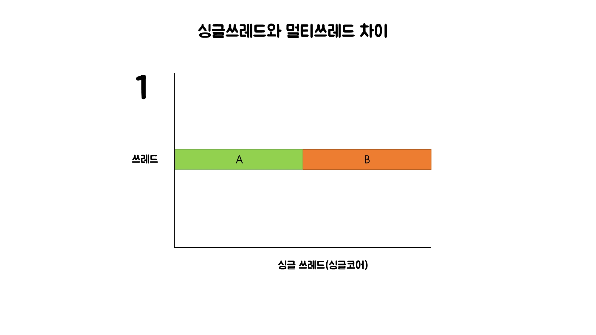
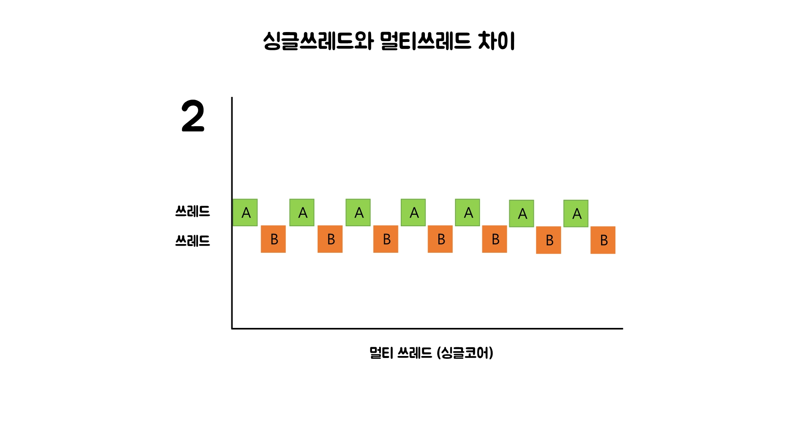
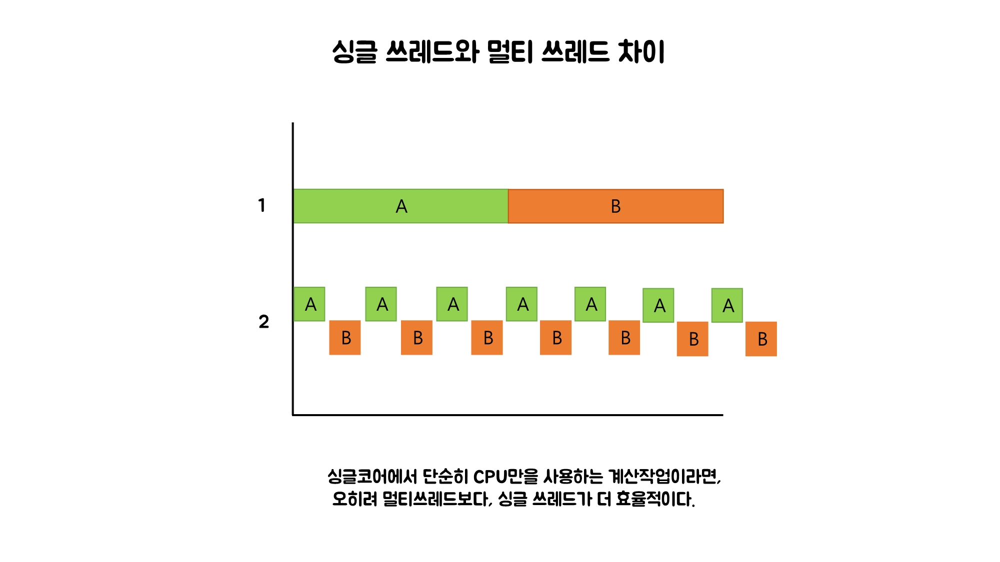
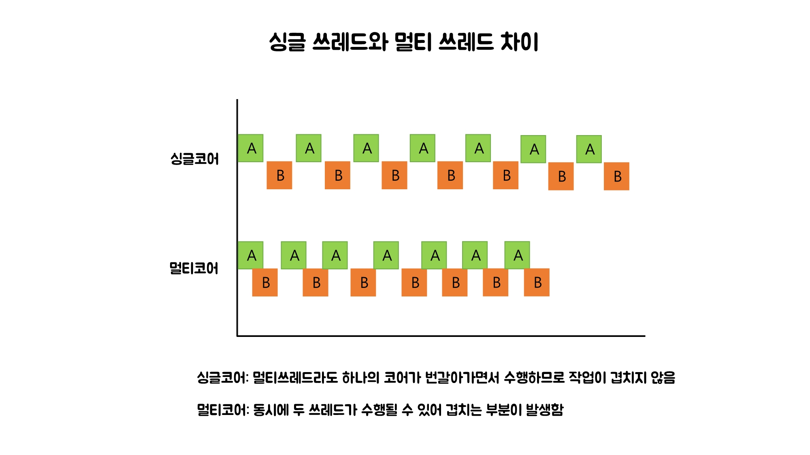
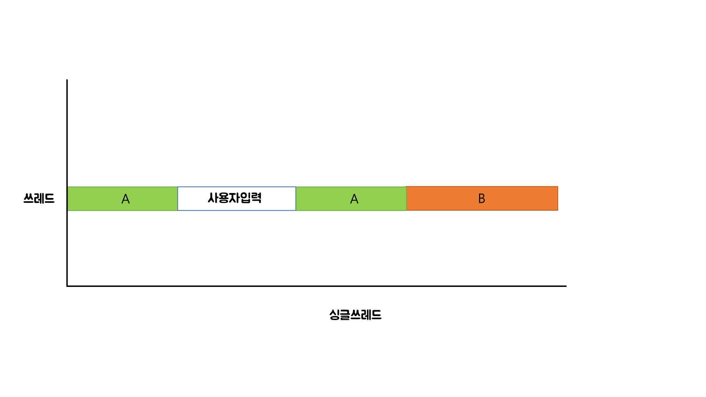
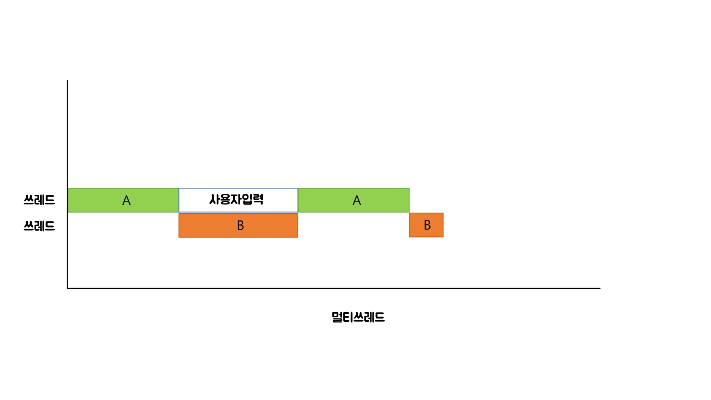
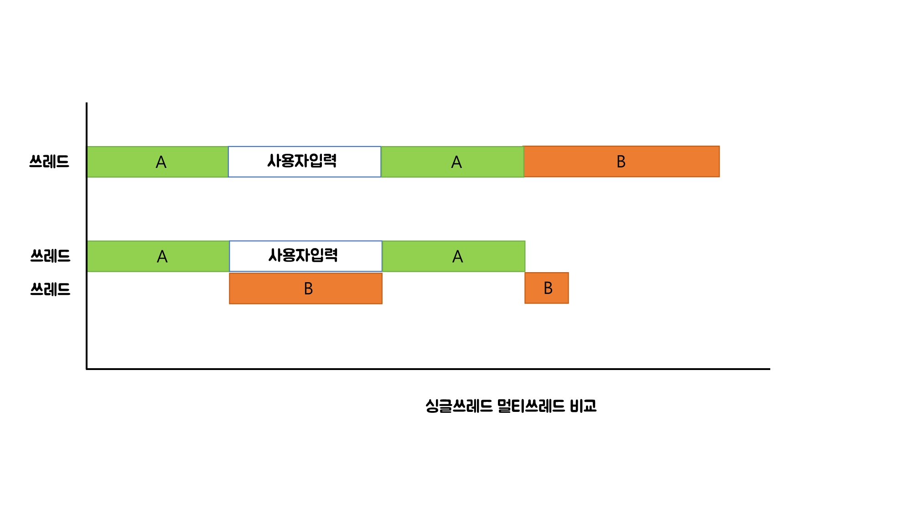

# 쓰레드(Thread)

## 목차

1. 프로세스와 쓰레드
2. 쓰레드의 구현과 실행(`start()`와 `run()`)
3. 싱글쓰레드와 멀티쓰레드
4. 쓰레드의 우선순위
5. 쓰레드 그룹(thread group)
6. 데몬 쓰레드(daemon thread)
7. 쓰레드의 실행제어
8. 쓰레드의 동기화

## 1. 프로세스와 쓰레드

### 프로세스

- 프로세스란 실행 중인 프로그램이다. 프로그램을 실행하면 OS로부터 실행에 필요한 자원(메모리)을 할당받아 프로세스가 된다.
- 프로세스는 프로그램을 수행하는데 필요한 데이터와 메모리 등의 자원과 스레드로 구성되어있다.


### 스레드

- 스레드는 프로세스의 자원을 이용해 실제 작업을 수행한다.
- 모든 프로세스에는 최소한 하나 이상의 스레드가 존재한다.
- 하나의 프로세스가 가질 수 있는 스레드의 개수는 제한되어있지 않으나 프로세스의 메모리 한계에 따라 생성할 수 있는 스레드의 수가 결정된다.
- 우리가 사용하는 main 또한 스레드이다. 프로그램 실행 시 제일 먼저 실행되는 스레드이며, 메인스레드라고도 한다.


## 2. 쓰레드의 구현과 실행(`start()`와 `run()`)

### 쓰레드의 구현

- 스레드를 구현하는 방법 : Thread 클래스를 상속, Runnable 인터페이스를 구현

  ```java
  public class ThreadExample {

    public static void main(String[] args) {
      ThreadEx1_1 threadFirst = new ThreadEx1_1(); // Thread 를 상속받은 클래스의 인스턴스

      Runnable r = new ThreadEx1_2(); // Runnable 을 구현한 클래스의 인스턴스
      Thread threadSecond = new Thread(r); // 생성자 Thread

      threadFirst.start();
      threadSecond.start();
    }
  }

  class ThreadEx1_1 extends Thread {
    public void run() {
      for (int i = 0; i < 5; i++) {
        System.out.println("첫번째 생성한 스레드는 : " + getName()); // 스레드를 직접 상속 받아왔기 때문에 getName() 을 바로 호출
      }
    }
  }

  class ThreadEx1_2 implements Runnable {

    public void run() {
      for (int i = 0; i < 5; i++) {
        System.out.println("두번째로 생성한 스레드는 : " + Thread.currentThread().getName()); // ThreadEx1_2의 멤버는 run()만 있기 때문에 Thread 클래스의 getName()을 호출하기 위해선, Thread.currentThread().getName()으로 호출한다
      }
    }
  }
  ```

Runnable 인터페이스는 Thread를 상속받은 클래스처럼 start() 메소드가 없다. 따라서 별도의 쓰레드를 생성 해주고 구현한 Runnable 인터페이스를 인자로 넘겨주어야 합니다.

- 쓰레드 이름 변경

  ```java
  public class ThreadA extends Thread {
    public ThreadA() {
        setName("ThreadA"); // setName을 이용하여 스레드 이름 변경
    }

    @Override
    public void run() {
        for (int i = 0; i < 5; i++) {
            System.out.println(getName() + "가 출력한 내용");
        }
    }
  }
  ```

### 쓰레드의 실행 - start() 와 run()

- `start()`

  - start() 호출 시 스레드가 실행된다.

  ```java
  ThreadA.start();
  ```

  - start() 호출 시 바로 실행되는 것이 아니라, 실행 대기 상태로 있다가 자신의 차례가 되면 실행된다. 실행 대기중인 스레드가 없으면 바로 실행된다.
  - 한 번 실행이 종료된 스레드는 다시 실행할 수 없다. 하나의 스레드에 start()는 한 번만 호출될 수 있다. 중복 호출 시 IllegalThreadStateException 에러 발생
  - 다시 실행하고 싶다면 새로운 스레드 생성 후 start() 호출
  - start()는 새로운 쓰레드가 작업을 실행하는데 필요한 호출스택을 생성한 다음 run을 호출해서
    생성된 호출스택에 run()이 첫 번째로 저장되게 합니다.

  

  - 위 그림의 설명순서

    1. main메서드에서 쓰레드의 start메서드를 호출합니다.
    2. start메서드는 쓰레드가 작업을 수행하는데 사용될 새로운 호출스택을 생성합니다.
    3. 생성된 호출스택에 run메서드를 호출해서 쓰레드가 작업을 수행하도록 합니다.
    4. 이제는 호출스택이 2개이기 때문에 스케쥴러가 정한 순서에 의해서 번갈아 가면서 실행합니다.

  - start() 메소드로 실행시키면 스레드가 순차적으로 실행되는게 아닌 병행 실행이 되기 때문에, 스레드의 실행이 일관적으로 나타나지 않는 것을 확인할 수 있다.

  

- `run()`
  - 스레드의 run() 메서드는 우리가 사용하는 main() 메서드와 같은 역할을 한다고 볼 수 있다. 스레드를 시작하면 run() 메서드 부터 시작하여 실행하기 때문이다.
  - 스레드를 시작할 때에는 구현한 run() 메서드로 시작하는게 아닌, start()메서드로 시작해야 정상적으로 실행시킬 수 있다.
  - 만약 스레드를 run() 메서드를 통해 실행시킨다면, 스레드는 main 메소드 위쪽에 스택으로 쌓이게 되며, 병행 처리를 하지 못하게 된다.
    

## 3. 싱글쓰레드와 멀티쓰레드



싱글쓰레드와 멀티쓰레드 중 속도는 어떤게 더 빠를까?

쓰레드간의 작업 전환(Context Switching)에 시간이 걸리기 때문



- 사용자로부터 데이터를 입력받는 작업
- 네트워크로 파일을 주고받는 작업
- 프린터로 파일을 출력하는 작업

과 같이 외부 기기와의 입출력을 필요로 하는 경우나
서로 다른 자원을 사용하는 작업의 경우에는 싱글쓰레드보다 멀티쓰레드가 더 효율적이다.




> 싱글 코어에서는 싱글 쓰레드로 두개의 작업을 하는 것이 멀티 쓰레드보다 빠르다.
> 멀티 코어에서는 멀티 쓰레드로 두개의 작업을 ㅎ는 것이 싱글 쓰레드보다 빠르다.

## 4. 쓰레드의 우선순위

### 쓰레드의 우선순위란?

- 쓰레드들이 새로 생성되면 우선순위를 갖게 된다.
- 우선순위의 범위는 1~10. 숫자가 높을 수록 우선순위가 높다.
- 우선순위는 쓰레드를 생성한 쓰레드로부터 상속받는다.
- main 메서드의 쓰레드 우선순위가 5이므로 main 메서드에서 생성하는 쓰레드의 우선순위는 5가 된다.

```java
void getPriority(int newPriority) // 쓰레드의 우선순위를 지정한 값으로 변경
int getPriority()                 // 쓰레드의 우선순위를 반환

public static final int MAX_PRIORITY  = 10 // 최대우선순위
public static final int MIN_PRIORITY  = 1  // 최소우선순위
public static final int NORM_PRIORITY = 5  // 보통우선순위
```

### 왜 필요한가?

- 예 ) 카카오톡 => 카톡채팅 기능, 사진을 받는 기능
  => 채팅기능의 우선순위가 낮다면? 사진을 보내는 동안, 채팅이 늦게 옴.
- 예 ) 줌 => 영상을 보는 기능, 채팅 기능
  => 영상기능의 우선순위가 낮다면? 채팅을 보내는 동안, 영상이 버벅임.
- 시각적인 부분이나 사용자에게 빠르게 반응해야 하는 작업을 하는 쓰레드의 우선순위는 다른 작업을 수행하는 쓰레드에 비해 높아야 한다.

## 5. 쓰레드 그룹(thread group)

- 서로 관련된 쓰레드를 그룹으로 묶어서 다루기 위한 것(보안상의 이유)
- 모든 쓰레드는 반드시 하나의 쓰레드 그룹에 포함되어 있어야 한다.
- 쓰레드 그룹을 지정하지 않고 생성한 쓰레드는 main쓰레드 그룹에 속한다.
- 자신을 생성한 쓰레드(부모 쓰레드)의 그룹과 우선순위를 상속받는다.

```java
public class Group {
    public static void main(String args[]) throws Exception {
        ThreadGroup main = Thread.currentThread().getThreadGroup();
        ThreadGroup grp1 = new ThreadGroup("Group1");
        ThreadGroup grp2 = new ThreadGroup("Group2");

        // ThreadGroup(ThreadGroup parent, String name)
        ThreadGroup subGrp1 = new ThreadGroup(grp1,"SubGroup1");

        grp1.setMaxPriority(3);	// 쓰레드 그룹 grp1의 최대우선순위를 3으로 변경.

        Runnable r = new Runnable() {
            public void run() {
                try {
                    Thread.sleep(1000); // 쓰레드를 1초간 멈추게 한다.
                } catch(InterruptedException e) {}
            }
        };

        // Thread(ThreadGroup tg, Runnable r, String name)
        Thread th1 = new Thread(grp1,     r, "th1");
        Thread th2 = new Thread(subGrp1,  r, "th2");
        Thread th3 = new Thread(grp2,     r, "th3");

        th1.start();
        th2.start();
        th3.start();

        System.out.println(">>List of ThreadGroup : "+ main.getName()
                +", Active ThreadGroup: " + main.activeGroupCount()
                +", Active Thread: "      + main.activeCount());
        main.list();
    }
}
```

## 6. 데몬 쓰레드(daemon thread)

- 일반 쓰레드의 작업을 돕는 보조적인 역할을 수행
- 일반 쓰레드가 모두 종료되면 자동적으로 종료된다.
- 가비지 컬렉터, 자동저장(한글 프로그램), 화면 자동갱신 등에 사용
- 무한루프와 조건문을 이용해서 실행 후 대기하다가 특정 조건이 만족되면 작업을 수행하고 다시 대기하도록 작성

```java
public class Daemon implements Runnable {
    static boolean autoSave = false;

    public static void main(String[] args) {
        Thread t = new Thread(new Daemon());
        t.setDaemon(true);        // 이 부분이 없으면 종료되지 않는다.
        t.start();

        for (int i = 1; i <= 10; i++) {
            try {
                Thread.sleep(1000);
            } catch (InterruptedException e) {
                e.getMessage();
            }
            System.out.println(i);

            if (i == 5)
                autoSave = true;
        }

        System.out.println("프로그램을 종료합니다.");
    }

    public void run() {
        while (true) {
            try {
                Thread.sleep(3 * 1000);    // 3초마다
            } catch (InterruptedException e) {
            }

            // autoSave의 값이 true 이면 autoSave()를 호출한다.
            if (autoSave) {
                autoSave();
            }
        }
    }

    public void autoSave() {
        System.out.println("작업파일이 자동 저장되었습니다.");
    }
}
```

- `setDaemon(boolean on)`은 반드시 `start()`를 호출하기 전에 실행되어야 한다. 그렇지 않으면 `IllegalThreadStateException`이 발생한다.

## 7. 쓰레드의 실행제어

### 쓰레드의 상태와 생명주기

- 쓰레드의 상태

  | 상태                   | 설명                                                                                                                                                |
  | ---------------------- | --------------------------------------------------------------------------------------------------------------------------------------------------- |
  | NEW                    | 쓰레드가 생성되었으나 아직 start()가 미호출된 상태                                                                                                  |
  | RUNNABLE               | 실행 또는 실행 가능 상태                                                                                                                            |
  | BLOCKED                | 동기화블럭에 의해 일시정지된 상태(lock이 풀리기까지 기다리는 상태)                                                                                  |
  | WAITING, TIMED_WAITING | 쓰레드의 작업이 종료되지 않았지만 실행가능하지 않은 일시정지 상태(sleep, wait, join 메서드에 의해 발생). TIMED_WAITING은 일시정지기간이 지정된 경우 |
  | TERMINATED             | 쓰레드의 작업이 종료된 상태                                                                                                                         |

- 쓰레드 생성 ~ 소멸 과정

### 쓰레드 스케줄링 메서드

- `sleep(long millis)`

  - 지정한 시간동안 쓰레드를 멈추게 함.
  - sleep()에 의해 일시정지 상태(WAITING)가 된 쓰레드는 지정된 시간이 다 되거나, sleep도중 interrupt()가 호출되면실행 대기 상태(RUNNABLE)가 된다.
  - sleep중인 쓰레드에 interrupt()가 호출되면 InterruptedException이 발생되므로 sleep()호출부에는 항상 try-catch문으로 예외처리를 한다.
  - 이때 문제가 있어서 try catch로 예외처리를 하는 게 아니라, try catch로 쓰레드를 깨우기 위한 것 뿐이라서 catch블록에 딱히 어떤 예외처리 작업을 해주지 않아도 된다.
  - 참고로 sleep()메서드를 호출할 때 쓰레드 참조변수로 메서드를 호출하는 것보다, Thread.sleep()으로 호출하는 게 더 좋다. sleep()은 항상 현재 실행중인 쓰레드에 작동되기 때문에 오해의 여지를 줄이기 위해 특정 인스턴스에 대해 호출하는 듯한 코드를 작성하지 않는 편이 좋겠다.

- `interrupt()`

  - 특정 쓰레드에게 작업 중단을 요청하는 메서드이며, 쓰레드의 interrupted 상태를 변경시킨다.
  - sleep중인(WAITING 상태인) 쓰레드에 InterruptedException예외를 발생시켜 실행 대기 상태(RUNNABLE)로 바꾸는 기능도 한다.
  - suspend(), stop()은 deprecated 되었기 때문에 자바에서는 사실상 쓰레드를 강제로 중단하는 방법이 없다. 그래서 쓰레드를 중단시키기 위해서는 interrupt()를 사용해야 한다.
  - 다만 interrupt도 쓰레드를 강제적으로 중단시키는 것은 아니고, 작업 중단을 요청한 쓰레드의 interrupted라는 변수 상태를 바꾸는 것 뿐이기 때문에 추가적인 작업이 필요하다.
  - interrupt()를 사용하는 과정 예시
    
    1. clock메서드에서 한글 시계를 출력하는 쓰레드 인스턴스에 interrupt()를 호출한다.
    2. 만약 출력 쓰레드가 sleep중이라면 InterruptException에러가 발생하여 catch 문에 진입한다.
    3. catch문에서 쓰레드 자기자신에게 interrupt()를 재호출하여 interrupted 인스턴스 변수 상태를 변경한다.
    4. while문이 변경된 interrupted 값을 감지하여 while문을 탈출하고 쓰레드가 종료된다.

- `suspend()`, `resume()`, `stop()`

  - suspend()는 sleep()처럼 쓰레드를 일시정지시킨다( -> WAITING ).
  - resume()은 suspend된 쓰레드를 다시 RUNNABLE상태로 만든다.
  - stop()은 쓰레드를 종료시킨다.
  - ❌ suspend(), stop()은 deprecated된 메서드입니다. 사용시 교착상태(deadlock)에 빠질 가능성이 높으므로 사용하지 않을 것을 권장합니다.
    - 교착상태(deadlock)란?  
      멀티 쓰레드 프로그래밍에서는 동기화를 통해 락을 획득하여 동일한 자원을 여러 곳에서 함부로 사용하지 못하도록 한다.
      하지만 두 개의 쓰레드에서 서로가 가지고 있는 락이 해제되기만을 무한정 기다리며 아무 작업도 수행하지 못하는
      상황이 발생할 수 있는데, 이러한 상태를 교착상태(deadlock)라고 한다.

- `yield()`

  - 다른 쓰레드에게 자신의 실행시간을 양보한다(나누어준다).
    
  - 쓰레드는 스케줄러에 의해 실행시간을 할당받고 작업을 수행한다. 이때 쓰레드가 작업 도중 yield()를 호출하면, 아직 자신에게 할당된 남은 시간을 다른 쓰레드에게 넘겨줄 수 있다. 그리고 쓰레드 자기 자신은 실행대기(RUNNABLE)상태가 된다.
  - 앞서 소개한 suspend와 같은 메서드를 쓰면 작업을 일시정지 시킬 수는 있지만, 일시정지된 쓰레드에게 주어진 시간은 계속 흘러간다(이러한 상태를 busy-wating상태라고 한다). 이 흘러가는 시간이란 자원을 효율적으로 쓸 수 있도록 해주는 게 yeild()메서드이다.

  - (그림에서는 yield호출 시점에 남은 시간만큼 다음 작업이 빨리 시작된다고 설명했지만, 쓰레드의 실행 시점은 OS의 스케줄러가 정하는 것이기 때문에 대기중인 쓰레드가 사실 정확히 5초 빨리 실행된다고는 장담할 수 없다.)
  - 사용법
     <br>
     <br>
    suspend 예제에서 SuspendEx 클래스에만 딱 세 줄이 추가되었다(ThreadEx는 동일).<br>
    실행중인 쓰레드에 suspend()를 호출했을 때, 우리는 쓰레드가 수행하는 getName()작업을 일시정지시킬 수 있다.<br>
    하지만 suspend예제에서는 while문을 탈출하지 못하고, 자기에게 주어진 시간을 아무 작업을 수행하지 않고 흘려보냈다.<br>
    위 코드에서는 suspend()가 호출된 경우 Thread.yield()를 호출하여 자신에게 주어진 남은 시간을 다른 쓰레드에게 양보하고 곧바로 실행대기 큐로 들어간 것이다.
    <br>
    그런데 이때 한 가지 문제가 더 있는데, suspend()나 stop()을 호출한 시점에 이 쓰레드가 sleep중일 수 있다는 것이다.<br>
    이 쓰레드는 남은 sleep시간이 다 끝나고 나서야 suspend, stopped 인스턴스 변수의 값이 바뀌었는지 확인할 것이고,<br>
    그만큼 yield() 또는 쓰레드를 종료하는 시간이 늦춰질 것이다.<br><br>
     <br>
    이러한 텀을 없애기 위해서 예제에서는 suspend()와 stop()메서드에 interrupt()호출 문장을 추가했다.<br>
    만약 suspend(), stop()이 호출된 시점에 쓰레드가 잠들어있다면 interrupt()로 곧장 깨워서 예외를 발생시킨 후,<br>
    yield()든 쓰레드 종료든 즉각 반응할 수 있게 해준 것이다.<br>
     <br>
    ThreadEx3는 suspend(), stop()에 interrupt()를 추가했기 때문에 실행시켜보면 별이 거의 정확히 1초마다 찍히지만,
    ThreadEx2는 실행시켜보면 미세하게 출력 시간이 일정하지 않은 걸 확인할 수 있다. 이는 남아있는 sleep시간을 기다려줘서 그렇다.

- `join()`
  - 쓰레드 자신의 작업을 멈추고 다른 쓰레드가 작업을 수행하도록 한다.
